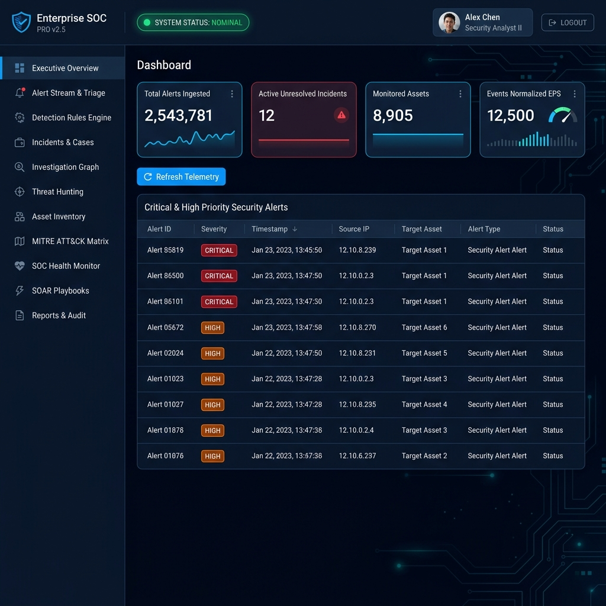

# 🛡️ Enterprise SOC Command Center & Analyst Simulation Platform

[](https://python.org)
[](https://fastapi.tiangolo.com)
[](#)
[](#)
[](#)

A high-performance, enterprise-grade Security Operations Center (SOC) platform, SIEM/SOAR simulation environment, and security analyst training lab. Built with a FastAPI microservice backend and a high-efficiency HTML5/CSS3/JavaScript Command Center UI, this project delivers real-time multi-source telemetry ingestion, Sigma detection rule execution, machine learning anomaly detection, automated SOAR playbooks, STIX2 threat intelligence enrichment, and comprehensive threat hunting.

---

## 📸 Executive Command Center



---

## 🚀 Key Features & Enterprise Capabilities

- **Real-Time Telemetry Pipeline**: Normalizes, validates, and deduplicates multi-source security streams (Windows Event Logs, Linux Syslog, Network PCAPs/Zeek, Wazuh EDR, Suricata IDS, and Application Audit Logs).
- **Dual Detection Engine**:
  - **Deterministic Rule Engine**: High-speed evaluation of Sigma, YARA-L, and custom behavioral rules against ingested events.
  - **Statistical Anomaly Engine**: Scikit-Learn based machine learning models for detecting zero-day anomalies and behavioral drift.
- **11 Modular SOC Workspaces**:
  1. **Executive Overview**: Real-time KPI metrics (EPS throughput, total alerts, open incidents, registered assets).
  2. **Alert Stream & Triage**: Interactive queue with severity badges, risk scoring, evidence modals, and analyst assignment.
  3. **Detection Rules Engine**: Catalog for tuning, enabling, disabling, and authoring rule sets.
  4. **Incidents & Cases**: Lifecycle management for active security cases (Containment, Eradication, Post-Incident Review).
  5. **Investigation Graph**: Vis.js powered interactive graph mapping threat relationships, hosts, IPs, and user entities.
  6. **Threat Hunting**: Structured query workspace for proactive threat hunting across historical telemetry stores.
  7. **Asset Inventory**: Enterprise asset tracking with posture indicators, IP/hostname mapping, and agent statuses.
  8. **MITRE ATT&CK Matrix**: Tactical matrix mapping active detections to MITRE ATT&CK tactics & techniques.
  9. **SOC Health Monitor**: Platform component status, integration health, queue depths, and sensor latencies.
  10. **SOAR Playbooks**: Automated orchestration engine executing containment actions (IP blocking, user isolation, host isolation).
  11. **Reports & Audit**: Audit trail viewer for compliance auditing and authenticated CSV/JSON report exports.
- **Enterprise Security Hardening**:
  - **7-Tier Role-Based Access Control (RBAC)** enforcing granular endpoint permissions.
  - **JWT Bearer Token Authentication** with secure token revocation and session management.
  - **Anti-SSRF Protection & Input Sanitization**: Strict Pydantic models for request validation and safe URL proxies.
  - **Zero-Exposed-Secrets**: Environment variable driven secret management via `.env`.

---

## 🏗️ Architecture & Pipeline Flow

```text
 ┌─────────────────────────────────────────────────────────────────────────────────┐
 │                            Telemetry Sources                                     │
 │  (Windows Sysmon / Linux Syslog / Network Zeek / Wazuh EDR / Suricata IDS)      │
 └───────────────────────────────────────┬─────────────────────────────────────────┘
                                         │
                                         ▼
 ┌─────────────────────────────────────────────────────────────────────────────────┐
 │                   REST Telemetry Ingestion API (Port 8001)                      │
 │    ┌─────────────────────────┬─────────────────────────┬───────────────────┐    │
 │    │    Validation Layer     │    Rate Limiter (Token) │   Auth Middleware │    │
 │    └─────────────────────────┴─────────────────────────┴───────────────────┘    │
 └───────────────────────────────────────┬─────────────────────────────────────────┘
                                         │
                                         ▼
 ┌─────────────────────────────────────────────────────────────────────────────────┐
 │                         Normalization & Deduplication                           │
 └───────────────────────────────────────┬─────────────────────────────────────────┘
                                         │
                                         ▼
 ┌───────────────────────────────────────┴─────────────────────────────────────────┐
 │                                                                                 │
 ▼                                                                                 ▼
┌────────────────────────────────────────┐       ┌─────────────────────────────────┐
│     Normalized Telemetry Storage       │       │    Dual Detection Engines       │
│  (SQLite / OpenSearch / Telemetry DB)  │       │  (Sigma Rules + ML Anomaly)     │
└────────────────────────────────────────┘       └────────────────┬────────────────┘
                                                                  │
                                                                  ▼
                                                 ┌─────────────────────────────────┐
                                                 │       Alert & SOAR Engine       │
                                                 │   (Playbooks & Containment)     │
                                                 └────────────────┬────────────────┘
                                                                  │
                                                                  ▼
 ┌─────────────────────────────────────────────────────────────────────────────────┐
 │                 SOC Command Center Web UI Dashboard (Port 8002)                 │
 └─────────────────────────────────────────────────────────────────────────────────┘
```

---

## 💻 Installation & Quick Start

### 1. System Requirements
- **OS**: Linux (Ubuntu 20.04+, Debian 11+, RHEL 8+), macOS, or Windows WSL2
- **Python**: 3.9+ (Python 3.10 or 3.11 recommended)
- **Dependencies**: `pip`, `venv`, `git`, `curl`

### 2. Clone Repository
```bash
git clone https://github.com/jenishs524/-Enterprise-SOC-Home-Lab.git
cd -Enterprise-SOC-Home-Lab
```

### 3. Create & Activate Virtual Environment
```bash
python3 -m venv venv
source venv/bin/activate
```

### 4. Install Dependencies
```bash
pip install --upgrade pip
pip install -r requirements.txt
```

### 5. Environment Configuration
Copy the template `.env.example` to `.env`:
```bash
cp .env.example .env
```

Edit `.env` to configure secret parameters (**never commit `.env` to public repositories**):
```env
# Generate a secret key: python3 -c "import secrets; print(secrets.token_hex(32))"
JWT_SECRET=<your-random-jwt-secret-key-32-chars-minimum>

# Administrative Password
LAB_ADMIN_PASSWORD=<your-secure-admin-password>

# Environment Modes: lab | staging | production
PLATFORM_MODE=lab
DATABASE_URL=sqlite:///soc_data.db
```

---

## 🚀 Running the Platform

### Automated Production Launch (Recommended)
Launch both the API Backend (Port 8001), Web Command Center (Port 8002), and Threat Feed Generator with a single script:

```bash
./production_start.sh
```

To stop all platform background processes:
```bash
./production_stop.sh
```

---

### Manual Launch (Separate Terminals)

**1. Start REST API Backend (Port 8001)**:
```bash
source venv/bin/activate
set -a; source .env; set +a
python3 -m uvicorn src.api:app --host 0.0.0.0 --port 8001
```

**2. Start Web Command Center UI (Port 8002)**:
```bash
source venv/bin/activate
python3 -m uvicorn src.web_ui:app --host 0.0.0.0 --port 8002
```

**3. Start Live Threat Simulation Feed**:
```bash
source venv/bin/activate
python3 scripts/generate_realistic_alerts.py --continuous
```

---

## 🌐 Web Dashboard & API Endpoints

| Resource / Interface | Access URL | Authentication Required | Description |
|---|---|---|---|
| **SOC Web Dashboard** | `http://localhost:8002` | Admin / User Token | Central 11-workspace Command Center UI |
| **Interactive API Docs** | `http://localhost:8001/docs` | None / Swagger UI | OpenAPI documentation & interactive testing |
| **Telemetry Health** | `http://localhost:8001/api/v1/telemetry/health` | None | API ingestion engine health status |
| **Alerts Stream API** | `http://localhost:8001/api/alerts` | Bearer Token | Paginated alert feed and triage endpoint |
| **Incidents API** | `http://localhost:8001/api/incidents` | Bearer Token | Incident lifecycle management |
| **SOAR Playbooks API** | `http://localhost:8001/api/v1/playbooks` | Bearer Token | Playbook catalog & execution |

---

## 🔐 Granular Role-Based Access Control (RBAC)

The platform implements 7 distinct role tiers to support realistic SOC team workflows:

| Role | Primary Responsibilities | Key Endpoint Permissions |
|---|---|---|
| **Admin** | Full system administration, RBAC control, API setup | `*` (All permissions) |
| **SOC Manager** | Oversight, executive metrics, audit log review, compliance | `audit.read`, `reports.read`, `metrics.read`, `incidents.read` |
| **Detection Engineer** | Rules authoring, YARA/Sigma tuning, MITRE mapping | `detections.read`, `detections.write`, `mitre.read` |
| **Incident Responder** | Incident closure, SOAR playbook execution, isolation | `incidents.update`, `playbooks.execute`, `cases.update` |
| **Threat Hunter** | Proactive telemetry query execution, IOC lookup | `hunting.read`, `telemetry.read`, `ioc.read` |
| **SOC Analyst L2** | Incident escalation, case creation, deeper triage | `alerts.update`, `incidents.create`, `cases.read` |
| **SOC Analyst L1** | Initial alert queue triage, status tagging, note assignment | `alerts.read`, `alerts.update` |
| **Read Only** | Observer mode for training, demoing, or auditing | `*.read` only |

---

## 🧪 Testing & Quality Assurance

The platform features an extensive Pytest test suite covering end-to-end functionality across all 9 design phases:

```bash
# Run entire test suite (55+ tests)
PYTHONPATH=. ./venv/bin/python -m pytest tests/ -v

# Run Dashboard & Navigation tests
PYTHONPATH=. ./venv/bin/python -m pytest tests/test_dashboard.py -v

# Run Analyst Simulation & SOAR tests
PYTHONPATH=. ./venv/bin/python -m pytest tests/test_phase9.py -v
```

---

## 📁 Project Directory Structure

```text
.Enterprise-SOC-Home-Lab/
├── config/                     # Detection rules, correlation configs & rule catalogs
│   └── rules/                  # Sigma, YARA, and custom rule definitions
├── docs/                       # Comprehensive documentation & visual assets
│   ├── dashboard_overview.png  # Main Command Center UI preview image
│   ├── LAB_SETUP.md            # Detailed lab setup guide
│   ├── SOAR.md                 # SOAR playbook development documentation
│   └── ...                     # Additional component specifications
├── scripts/                    # Threat feed generators and maintenance scripts
│   ├── generate_realistic_alerts.py
│   └── ...
├── src/                        # Core Application Source Code
│   ├── api.py                  # FastAPI REST API endpoints & route handlers
│   ├── web_ui.py               # Web Command Center UI server & HTML/JS engine
│   ├── security.py             # JWT authentication, password hashing & RBAC matrix
│   ├── database.py             # Database ORM, SQLite connector & schemas
│   ├── detection_engine.py     # Deterministic rule evaluation engine
│   ├── ml_detector.py          # Machine learning anomaly detection models
│   ├── incident_manager.py     # Case management & incident state machine
│   ├── threat_hunting.py       # Telemetry hunting query engine
│   ├── soar/                   # SOAR playbook engine & automated response actions
│   └── telemetry/              # Multi-source adapters (Wazuh, Suricata, Zeek, etc.)
├── tests/                      # Automated Pytest suite (Phases 1 through 9)
├── production_start.sh         # One-click background launcher
├── production_stop.sh          # One-click process terminator
├── .env.example                # Environment configuration template
└── README.md                   # System documentation
```

---

## 🛡️ Security & Privacy Notice

- **No Hardcoded Secrets**: This repository does not contain hardcoded passwords, tokens, or private keys.
- **Environment Isolation**: Always generate a unique `JWT_SECRET` and `LAB_ADMIN_PASSWORD` in your local `.env` file.
- **Lab Data**: All alerts and telemetry events generated by default are synthetic simulation data designed for lab learning and operational practice.

---

## 📜 License

Distributed under the **MIT License**. See `LICENSE` for more information.
